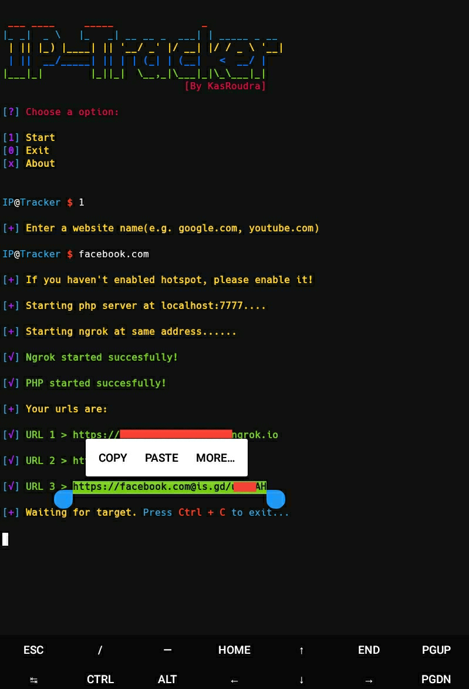
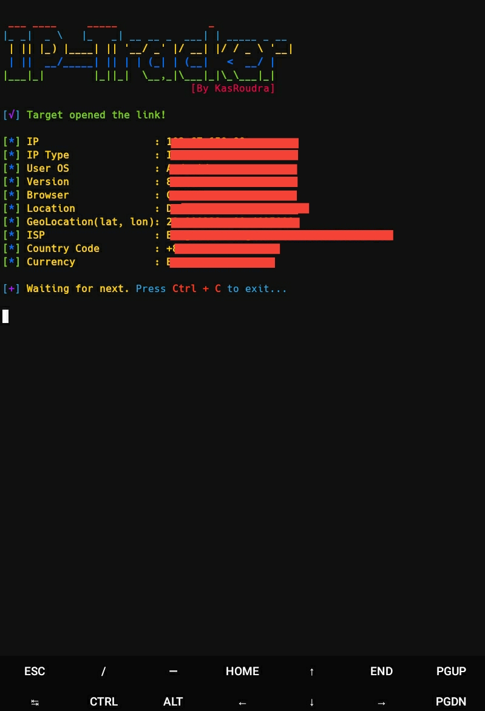

<h2 align="center"><u>IP-Tracker</u></h2>


<h4 align="center"> Track IP with tricky link! </h4>

<p align="center">
    
    
<br>
    
    
    
    
</p>

### [+] Description
IP-Tracker is a tool that simply take a website as input and generate a phishing link. That phishing link looks normal; if anyone opens the link his/her ip will be captured and he/she will be redirected to the website taken as input.

### [+] Installation
 - `git clone https://github.com/KasRoudra/IP-Tracker`
 - `cd IP-Tracker`
 - `bash ip.sh`

##### Or run directly
```
wget https://raw.githubusercontent.com/KasRoudra/IP-Tracker/main/ip.sh && bash ip.sh
```

### [+] Features
 - Tricky link
 - Dual Tunneling (Ngrok and Cloudflared)
 - Redirect to website according to wish
 - Get many details along with ip like location, geolocation

### [+] Previews

##### Waiting for victim to open link


##### After victim opened link



### [+] Dependencies
 - `php`
 - `wget`
 - `curl`
 - `unzip`

All necessary dependencies will be automatically installed in first run!

### [+] Disclaimer 
***This tool is developed for educational purposes. Here it demonstrates how ip-trackers work. If anybody wants to gain unauthorized access to someones IP-Address, he/she may try out this at his/her own risk. You have your own responsibilities and you are liable to any damage or violation of laws by this tool. The author is not responsible for any misuse of IP-Tracker!***

### [+] Find me on 
<a href="mailto:kasroudrakrd@gmail.com" target="_blank"></a>

<a href="https://m.me/KasRoudra" target="_blank"></a>

